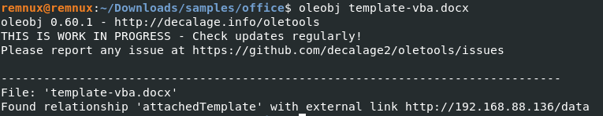

## Office Document Analysis

All of the following examples will work for most types of office documents, the exception being OneNote files

The tools used in this guide come from the oleTools [github](https://github.com/decalage2/oletools) which are already available to use on Remnux.

### Hyperlinks

Extracting hyperlinks from office documents is very straight forward. To do so all you have to do is run the command oleobj to extract suspected phishing urls from a document.

### VBA Scripts

Office docs can contain macros for automation, attackers can use these scripts to run commands when the document is opened or when macros get enabled. OleVBA can be used to analyze the scripts. It will print out the script and give a summary at the end.

In order to extract the raw script a tool called `oledump.py` can be used to extract the raw script. When looking at the output of the script the M indicates that a script is within that object.

You can extract the content of that object by using the command `oledump.py -v -s 7 <filename>` where -s is used to specify which object.

You can pipe this into a new file so save the contents of the script where you can upload this to your preferred sandbox tools.

### External Resources

Sometimes an office document has executed vba scripts but when looking at it statically theres no evidence of macros within it. In this scenario office documents can load VBA macros from external servers using template injection.

The only indicator you would see when statically analyzing these types of documents would look like the following image.

Whats happening is when this document is opened it loads a template from that server address. At this server address I am hosting a dotm file containing a macro inside of it. All of this will result in the user still being prompted to enable macros when the document is opened.

It would be up to the analyst if they want to pursue the script hosted on the web server or just collect the IOC of the URL and move on.

### Last Resort Approach

!!! TODO
Markdown will be added to after use case documents have been created / collected
