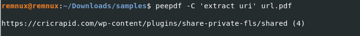

## PDF Analysis

The main tool to use is PeePDF. The features you'll use the most are interactive mode with `-i` and running commands from interactive mode directly in the terminal with '`C "<command>"`. If you ever get an error related to `%%EOF not found` use the switch `-f` to ignore errors.

### URLs

Extracting URLs from PDFs is a simple task when dealing with documents that exist just to contain hyperlinks for phishing. A user can analyze a document with peepdf to see if a document contains a URL.

### Scripts

Extracting scripts from PDFs can be a bit more of a complex process at times.
A walk through of a simple script and an advanced script will be shown.

#### Simple Example

When first analyzing a pdf with peepdf you will be shown at the bottom if there are automated actions in the pdf, in this case there is an **OpenAction**. The square brackets indicate which object within the document contains what is in that open action.

Extracting this script is as simple as entering interactive mode with `peepdf -i sample1.pdf` and viewing object 1

Here we see a bat script that is to be ran when a user clicks the button referenced, you can extract this by copying the relevant parts into a new text file. In this case I will copy from cmd.exe onward, if you would like external tools to further analyze this script you can add the file extension **.bat** and place the sample in a password protected zip folder and upload it to a sandbox environment.

---

#### Advanced Example

This pdf contains multiple suspicious objects within it, understanding basic programming concepts will help in understanding this section. To start I look at the file info where JS is identified in the file. Requesting object 1 shows that the **OpenAction** is causing javascript to run on open which is referenced in object 5.

##### Extracting The Script

The script can be viewed by either the command `extract js` or `object 5`

There are a couple parts of interest in this script:

- `.getAnnots` is responsible for loading the annotations within the document.
- `.subject` is responsible for reading the stream of data for the selected annotation.
- At the bottom there is a call `app[fnc](buff)` where `app[fnc]` is just an obfuscated use of the eval command.
- `sum` being assigned a value from what appears to be an annotation in the PDF in this case the one at offset 1 or annotation 2 which is stream 9 in peepdf.

##### Further Extraction

Using peepdf to extract stream 9 we see the following encoded data.

We can take this encoded stream and manually place it in our original script, I have commented out the unnecessary parts of the script to highlight the important parts of the script.

After running our modified script a new piece of js is decoded and we can place this in a new file to analyze.

##### Script Within A Script

Before trying to analyze the script we can pass it into CyberChef using the `JavaScript Beautify` function to properly format the code.

Looking at the code there is another block that is reading from an annotation, in this case its annotation 1 which is inside object 7 in peepdf. We can comment out the irrelevant parts and manually assign the variable to the data that would be in object 7.

Again at the end of this script we see an eval being used. We can simply comment out this and log this to console instead.

Now that we have modified this script we can run it to see what its trying to do. Unfortunately the output is not very useful.

##### Function Reading A Function

A keen eye would notice after trying to modify a few things that every change you make inside the function causes the output to be different. This is evidence that the function is reading itself, you can get around it by taking the original form of the function and assigning the value.

Running the script now gives us a final obfuscated script returned to us. Inside the script it isn't trying to read any more contents from inside the PDF and at this point you have all the malicious artifacts from inside the PDF, and could potentially forward this off to other open source tools. The purpose of this final script is to exploit a buffer overflow inside of Adobe Acrobat.

